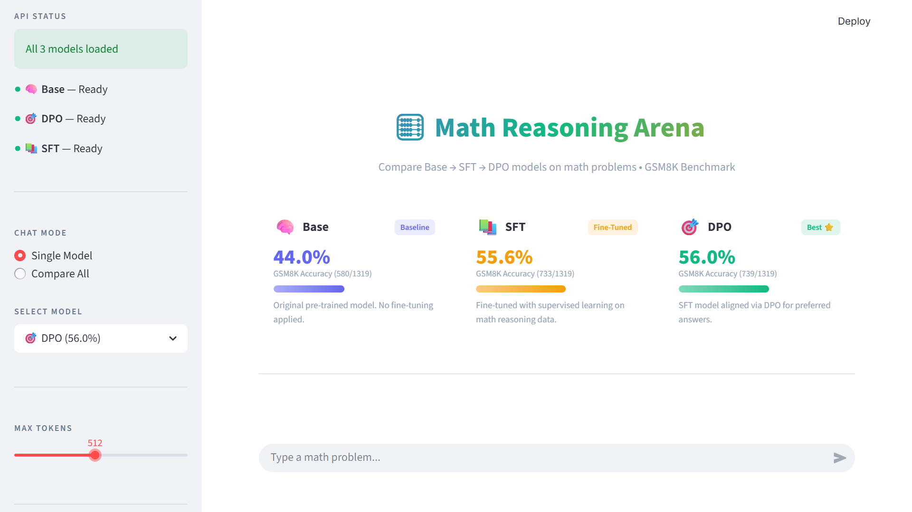

# Math Reasoning Arena 🧮

A two-stage alignment project (SFT + DPO) to enhance the mathematical reasoning capabilities of small language models (SLMs).

## 🔭 Project Overview

The goal of this project is to take a base 0.5B model and transform it into a specialized math reasoning assistant. We utilize a modern training pipeline:

1. **SFT (Supervised Fine-Tuning)**: Initial instruction tuning on high-quality step-by-step math reasoning.
2. **DPO (Direct Preference Optimization)**: Alignment stage where the model learns to prefer correct reasoning steps over incorrect ones.

## 📂 Datasets & Training Info

The project leverages structured math reasoning data across three distinct stages:

* **1. SFT Dataset (`datasets/sft_dataset`)**:
  * **Source**: [](https://huggingface.co/datasets/meta-math/MetaMathQA).
  * **Type**: Instruction-Response pairs.
  * **Content**: 2,000+ high-quality math problems with detailed, step-by-step "Chain-of-Thought" solutions.
  * **Goal**: Teaching the model the logic and format of mathematical reasoning.
  * **Example**:

        ```json
        {
          "query": "John has 3 apples. He buys 2 more. How many does he have?",
          "response": "John starts with 3 apples. He buys 2 more, so 3 + 2 = 5. John has 5 apples.\n#### 5"
        }
        ```

* **2. DPO Dataset (`datasets/dpo_dataset`)**:
  * **Source**: [](https://huggingface.co/datasets/argilla/distilabel-math-preference-dpo).
  * **Type**: Preference pairs (Chosen vs. Rejected).
  * **Content**: Contrastive examples where the model's own incorrect logic was paired against corrected ground-truth reasoning paths.
  * **Goal**: Aligning the model to reject common logical errors and prefer precise calculations.
  * **Example**:

        ```json
        {
          "instruction": "John has 3 apples. He buys 2 more. How many does he have?",
          "chosen_response": "John starts with 3 apples. He buys 2 more, so 3 + 2 = 5.\n#### 5",
          "rejected_response": "John starts with 3 apples. 3 times 2 is 6.\n#### 6"
        }
        ```

* **3. Evaluation Dataset**:
  * **Source**: [GSM8K (Grade School Math 8K)](https://huggingface.co/datasets/openai/gsm8k).
  * **Split**: Full `test` split consisting of **1,319 samples**.
  * **Goal**: Measuring the real-world accuracy of the models across the training lifecycle.
  * **Example**:

        ```json
        {
          "question": "Janet’s ducks lay 16 eggs per day. She eats three for breakfast every morning and bakes muffins for her friends every day with four. She sells the remainder at the farmers' market daily for $2 per fresh duck egg. How much in dollars does she make every day at the farmers' market?",
          "answer": "Janet sells 16 - 3 - 4 = <<16-3-4=9>>9 duck eggs a day.\nShe makes 9 * 2 = $<<9*2=18>>18 every day at the farmer's market.\n#### 18"
        }
        ```

## 📊 Key Results (GSM8K Benchmark)

We compared a modern SLM (Qwen 2.5 0.5B) against a legacy baseline (GPT-2) to measure the impact of tuning.

| Stage | Qwen 2.5 0.5B | GPT-2 |
| :--- | :--- | :--- |
| **Base** | 44.0% | ~5.0% |
| **SFT** | 55.6% | 5.4% |
| **DPO** | **56.0%** | 5.5% |

*Key finding: Tuning unlocked a +12% accuracy gain in Qwen, while legacy architectures like GPT-2 showed no significant reasoning improvement, emphasizing the importance of base pre-training quality.*

## 🚀 Deployment & Usage

The project includes a **Math Reasoning Arena** (Flask + Streamlit) for side-by-side model comparison.

### 1. Requirements

Install dependencies:

```bash
python -m pip install -r requirements.txt
```

### 2. Launch the Application

Run the automated launcher:

```powershell
.\run_app.bat
```

*This starts the Flask API (Port 5000) and the Streamlit UI (Port 8501).*

> [!NOTE]
> **Cloud HuggingFace Weights (Plug & Play)**: While the massive local models are kept out of this repository due to Git size limits, the `flask_api.py` backend is natively hardcoded to my Hugging Face Hub repos (`mostafa-nasr14/Qwen-Math-SFT`). **This means you can clone and run the app out-of-the box!** The matrices will automatically stream from the cloud on the first boot. For reviewers interested in the original alignment methodology, the complete SFT and DPO `trl` training pipelines are enclosed in the `scripts/` folder.

## 📂 Project Structure

* `api/flask_api.py`: Backend service hosting three model variants.
* `app/streamlit_app.py`: Premium UI for multi-model reasoning comparison.
* `scripts/`: Training and evaluation scripts for SFT and DPO phases.
* `output/`: Model checkpoints and merged adapters.
* `PROJECT_REPORT.md`: Detailed technical analysis of the project outcomes.

## ✨ Engineering & Historical Techniques

To ensure the application runs smoothly on consumer hardware and provides a high-quality user experience, several key engineering techniques were applied historically throughout development:

* **Conversational Memory Buffer**: The Flask API was designed to accept complete JSON chat histories, wrapping past interactions in the Qwen specific `<|im_start|>` ChatML format. This allows the models to remember context across multi-turn conversations in the Streamlit UI.

* **LoRA (Low-Rank Adaptation)**: During the SFT and DPO phases, training full weights was avoided. Instead, updates were constrained to low-rank matrices across the query/value attention layers, keeping VRAM requirements within accessible limits.

## 🛠️ Tech Stack

* **Frameworks**: HuggingFace Transformers, PEFT (LoRA), TRL (DPOTrainer).
* **Backend**: Flask with CORS support.
* **Frontend**: Streamlit with custom CSS architecture.
* **Architecture**: Qwen 2.5 (0.5B Parameters).

* **APP UI**

